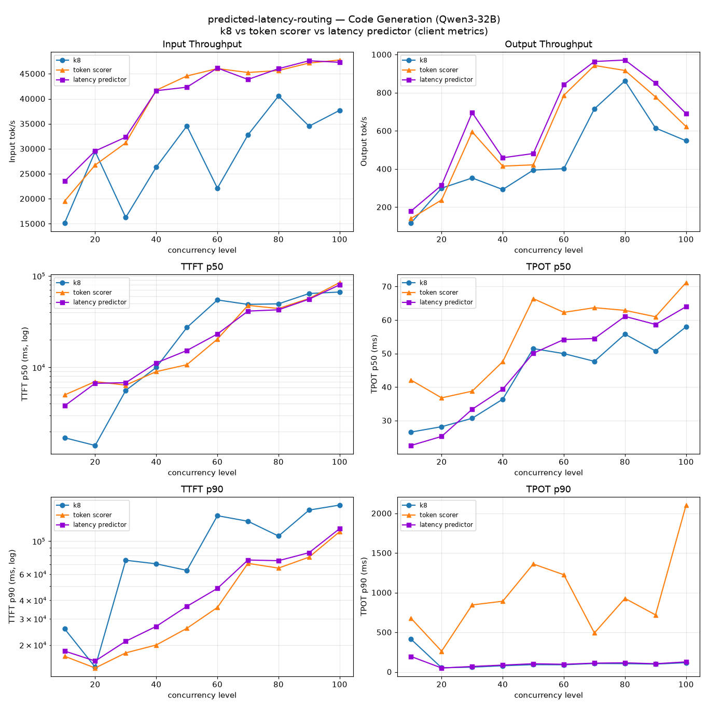
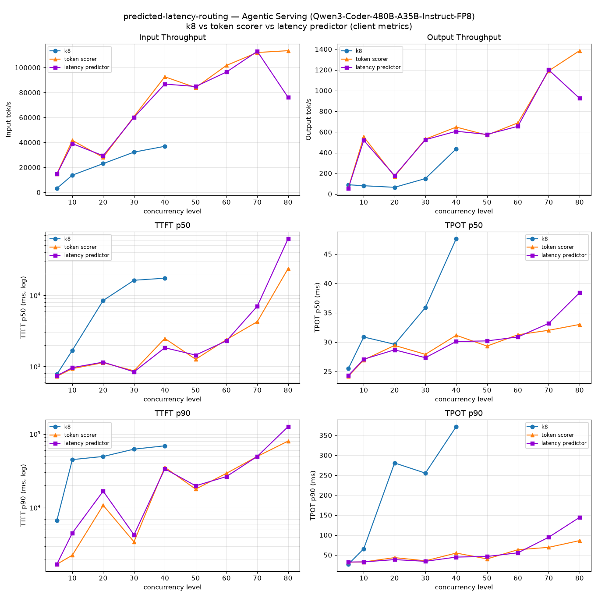

# Predicted Latency-Based Routing

[](https://github.com/llm-d/llm-d/actions/workflows/consolidate-status-predicted-latency-routing-cks-acc-gpu-vllm-x.yaml)
[](https://github.com/llm-d/llm-d/actions/workflows/consolidate-status-predicted-latency-routing-gke-acc-gpu-vllm-x.yaml)
[](https://github.com/llm-d/llm-d/actions/workflows/consolidate-status-predicted-latency-routing-ibm-acc-gpu-vllm-x.yaml)
[](https://github.com/llm-d/llm-d/actions/workflows/consolidate-status-predicted-latency-routing-amd-ci-acc-rocm-vllm-x.yaml)

## Overview

Route each inference request to the model server predicted to serve it fastest — and, optionally, only to a server predicted to meet its TTFT/TPOT SLO.

This path is for operators who want to **adopt** predicted latency-based scheduling in an existing llm-d deployment. For what the component is and how it works internally — the plugin pipeline, the ML model, scaling characteristics, the full metric list — see [architecture/advanced/latency-predictor.md](../../docs/architecture/advanced/latency-predictor.md).

## When to Pick This Path

Pick it when:

- Your workload has **high variance in prompt and completion length**, and queue depth alone is a poor proxy for true load.
- Your clients can express **per-request latency SLOs** (interactive vs. batch) and you want the gateway to enforce them.
- Static weight tuning between cache affinity and load has become **fragile** as traffic shifts.

Skip it when your pool is **heterogeneous** — mixed GPU types, model variants, or serving configurations in the same pool will produce inaccurate predictions, because the predictor assumes a single pod shape.

> [!NOTE]
> OpenShift support for this guide is currently not reliable as-is. The latency-predictor sidecars used by predicted-latency scheduling may require additional OpenShift-specific runtime adjustments beyond the manifests in this guide. Until that is resolved, prefer GKE or CoreWeave for the tested path.

## Prerequisites

- Have the [proper client tools installed on your local system](../../helpers/client-setup/README.md) to use this guide.
- Checkout llm-d repo:

  ```bash
    export branch="main" # branch, tag, or commit hash
    git clone https://github.com/llm-d/llm-d.git && cd llm-d && git checkout ${branch}
  ```

- Set the following environment variables:

  ```bash
    export REPO_ROOT=$(realpath $(git rev-parse --show-toplevel))
    source ${REPO_ROOT}/guides/env.sh
    export GUIDE_NAME="predicted-latency-routing"
    export NAMESPACE=llm-d-predicted-latency
    export MODEL_NAME="Qwen/Qwen3-32B"
  ```

- Install the Gateway API Inference Extension CRDs:

  ```bash
    kubectl apply -f https://github.com/kubernetes-sigs/gateway-api-inference-extension/releases/download/${GAIE_VERSION}/v1-manifests.yaml
  ```

- Create a target namespace for the installation:

  ```bash
    kubectl create namespace ${NAMESPACE}
  ```

- [Create the `llm-d-hf-token` secret in your target namespace with the key `HF_TOKEN` matching a valid HuggingFace token](../../helpers/hf-token.md) to pull models.
<!-- llm-d-cicd:skip start -->
  ```bash
  export HF_TOKEN="your-huggingface-token"  # replace with a valid HuggingFace token
  kubectl create secret generic llm-d-hf-token \
    --from-literal="HF_TOKEN=${HF_TOKEN}" \
    --namespace "${NAMESPACE}" \
    --dry-run=client -o yaml | kubectl apply -f -
  ```
<!-- llm-d-cicd:skip end -->

## Installation Instructions

### 1. Deploy the llm-d Router

Three ready-to-use values files ship with this guide:

| File | When to use |
|---|---|
| [`router/predicted-latency.values.yaml`](./router/predicted-latency.values.yaml) | Default — predictor trains on end-to-end latency. Routing-only, no SLO header support. |
| [`router/predicted-latency-slo.values.yaml`](./router/predicted-latency-slo.values.yaml) | SLO-aware — Assumes `x-llm-d-slo-ttft-ms` / `x-llm-d-slo-tpot-ms` are set on requests. Enforcing a TPOT SLO means predicting TPOT, so this sets `streamingMode: true` and every request must be sent with `"stream": true`. |
| [`router/predicted-latency-pd.values.yaml`](./router/predicted-latency-pd.values.yaml) | Prefill/decode disaggregated — predicted-latency scheduling layered on the [pd-disaggregation](../pd-disaggregation) pipeline: prefill is picked on predicted TTFT, decode on predicted TPOT. Sets `streamingMode: true`, so every request must be sent with `"stream": true`. |

The first two target model server pods labeled `llm-d.ai/guide=optimized-baseline`, since in the next step we will simply reuse the model server manifests from the [optimized-baseline guide](../optimized-baseline). The P/D file instead targets `llm-d.ai/guide=pd-disaggregation` — see [Prefill/Decode Disaggregation](#prefilldecode-disaggregation--gpt-oss-120b) below.

#### Standalone Mode

This deploys the llm-d Router with an Envoy sidecar, it doesn't set up a Kubernetes Gateway.

```bash
helm install ${GUIDE_NAME} \
    ${ROUTER_STANDALONE_CHART} \
    -f ${REPO_ROOT}/guides/recipes/router/base.values.yaml \
    -f ${REPO_ROOT}/guides/${GUIDE_NAME}/router/predicted-latency.values.yaml \
    -n ${NAMESPACE} --version ${ROUTER_CHART_VERSION}
```

Nightly CI also sets `--set router.monitoring.prometheus.auth.enabled=false` so the validation job can scrape EPP metrics without a bearer token. That override is CI-only; leave metrics auth enabled for normal deployments unless you explicitly need unauthenticated scraping.

For SLO-aware scheduling, swap the values file: `-f guides/${GUIDE_NAME}/router/predicted-latency-slo.values.yaml`.

<details>
<summary><h4>Gateway Mode</h4></summary>

To use a Kubernetes Gateway managed proxy rather than the standalone version, follow these steps instead of applying the previous Helm chart:

1. *Deploy a Kubernetes Gateway* by following one of [the gateway guides](../../docs/infrastructure/gateway).
2. *Deploy the llm-d Router and an HTTPRoute* that connects it to the Gateway as follows:

```bash
export PROVIDER_NAME=gke # options: none, gke, agentgateway, istio
helm install ${GUIDE_NAME} \
    ${ROUTER_GATEWAY_CHART} \
    -f ${REPO_ROOT}/guides/recipes/router/base.values.yaml \
    -f ${REPO_ROOT}/guides/recipes/router/features/httproute-flags.yaml \
    -f ${REPO_ROOT}/guides/${GUIDE_NAME}/router/predicted-latency.values.yaml \
    --set provider.name=${PROVIDER_NAME} \
    -n ${NAMESPACE} --version ${ROUTER_CHART_VERSION}
```

</details>

### 2. Deploy the Model Server

This guide reuses the model server manifests from the optimized-baseline guide (the values files above already select pods labeled `llm-d.ai/guide=optimized-baseline`) and applies RoPE scaling on top to allow longer prompts. Apply the default NVIDIA GPU / vLLM overlay:

```bash
export INFRA_PROVIDER=base # base | gke
kubectl apply -n ${NAMESPACE} -k ${REPO_ROOT}/guides/predicted-latency-routing/modelserver/gpu/vllm/${INFRA_PROVIDER}/
```

#### TPU — Qwen3-Coder-480B-A35B-Instruct-FP8 with KV-cache offloading

For the long-context agentic case on Google TPU v7x (2x2x1), reuse the [agentic-serving guide's](../agentic-serving) model server. It is re-labeled `llm-d.ai/guide=optimized-baseline` so the router values above select it with no changes (same as the GPU path), and the latency predictor is EPP-side only, so the model server needs no predictor-specific changes:

```bash
kubectl apply -n ${NAMESPACE} -k ${REPO_ROOT}/guides/predicted-latency-routing/modelserver/tpu/vllm/
```

> [!NOTE]
> Set `MODEL_NAME="Qwen/Qwen3-Coder-480B-A35B-Instruct-FP8"` for the TPU path — the verification and benchmark steps below use it.

#### Prefill/Decode Disaggregation — gpt-oss-120b

Predicted-latency scheduling also composes with prefill/decode disaggregation. Reuse the [pd-disaggregation guide's](../pd-disaggregation) model server (8 prefill TP=1 + 2 decode TP=4, `openai/gpt-oss-120b`) unchanged — the predictor is EPP-side only — and deploy the router with the P/D values file:

```bash
export MODEL_NAME="openai/gpt-oss-120b"
export INFRA_PROVIDER=gke # base | coreweave | gke | aws

helm install ${GUIDE_NAME} \
    ${ROUTER_STANDALONE_CHART} \
    -f ${REPO_ROOT}/guides/recipes/router/base.values.yaml \
    -f ${REPO_ROOT}/guides/${GUIDE_NAME}/router/predicted-latency-pd.values.yaml \
    -n ${NAMESPACE} --version ${ROUTER_CHART_VERSION}

kubectl apply -n ${NAMESPACE} -k ${REPO_ROOT}/guides/pd-disaggregation/modelserver/gpu/vllm/${INFRA_PROVIDER}
```

The `gke` overlay carries KV transfer over RDMA/RoCE (DRA + DRANet), which is what the benchmark below measures; it requires a [pre-provisioned cluster](../pd-disaggregation/README.md#gke-cluster-pre-provisioning-with-dra--rdmaroce). The `base` overlay works anywhere but moves KV over TCP, which caps prefill throughput well below the numbers reported here.

Two things differ from the aggregated path. The prefill profile is scored purely on predicted TTFT and the decode profile purely on predicted TPOT, since each stage only owns one half of the request's latency. And cache affinity runs on prefill only — in P/D the prefix cache lives on the prefill pods and decode receives KV over NIXL, so a decode-side affinity filter adds nothing while skewing balance.

> [!IMPORTANT]
> The P/D values file sets `streamingMode: true`, so clients must send `"stream": true`. TPOT training samples come from the inter-token gaps of a streamed response, and decode here is scheduled purely on predicted TPOT — so non-streaming traffic leaves the half of the predictor that places decode with nothing to learn from.

For other backends (AMD GPU, Intel XPU, CPU), see [optimized-baseline → Deploy the Model Server](../optimized-baseline/README.md#2-deploy-the-model-server). For example, for sglang deployments:

```bash
kubectl apply -n ${NAMESPACE} -k ${REPO_ROOT}/guides/optimized-baseline/modelserver/gpu/sglang/${INFRA_PROVIDER}/
```

### 3. Enable monitoring (optional)

Follow [optimized-baseline → Enable monitoring](../optimized-baseline/README.md#3-optional-enable-monitoring) — the same steps apply since this guide reuses the same model server manifests.

## Send Requests

Once enabled, latency-based scheduling works on every request — no header changes needed. The proxy picks the endpoint with the lowest predicted latency.

To opt an individual request into SLO-aware routing, add one or both headers:

- `x-llm-d-slo-ttft-ms` — Time-to-first-token SLO in milliseconds.
- `x-llm-d-slo-tpot-ms` — Time-per-output-token SLO in milliseconds.

### 1. Get the IP of the Proxy

**Standalone Mode**

```bash
export IP=$(kubectl get service ${GUIDE_NAME}-epp -n ${NAMESPACE} -o jsonpath='{.spec.clusterIP}')
```

<details>
<summary> <b>Gateway Mode</b> </summary>

```bash
export IP=$(kubectl get gateway llm-d-inference-gateway -n ${NAMESPACE} -o jsonpath='{.status.addresses[0].value}')
```

</details>

### 2. Send a Test Request

**Open a temporary interactive shell inside the cluster:**

```bash
kubectl run curl-debug --rm -it \
    --image=cfmanteiga/alpine-bash-curl-jq \
    --namespace="$NAMESPACE" \
    --env="IP=$IP" \
    --env="NAMESPACE=$NAMESPACE" \
    --env="MODEL_NAME=$MODEL_NAME" \
    -- /bin/bash
```

**Send a completion request:**

```bash
curl -X POST http://${IP}/v1/completions \
    -H 'Content-Type: application/json' \
    -H 'x-llm-d-slo-ttft-ms: 200' \
    -H 'x-llm-d-slo-tpot-ms: 50' \
    -d '{
        "model": "'${MODEL_NAME}'",
        "prompt": "Explain the difference between prefill and decode.",
        "max_tokens": 200,
        "temperature": 0,
        "stream": true,
        "stream_options": {"include_usage": true}
    }'
```

Sheddable requests (priority < 0) are rejected at admission when no endpoint can meet the SLO, rather than routed to a guaranteed miss.

## Verify

Once traffic is flowing, confirm three things in Prometheus (see the [architecture doc](../../docs/architecture/advanced/latency-predictor.md#observability) for the metric reference):

1. **Predictions are being produced.** `inference_objective_request_ttft_prediction_duration_seconds` has non-zero samples. If it stays empty, the predictor sidecar is not being called — tail the EPP logs for `predicted-latency-producer` errors.
2. **Predictions track reality.** Compare `inference_objective_request_predicted_ttft_seconds` against `inference_objective_request_ttft_seconds` over a rolling window. A healthy deployment converges to within a few percent after warmup.
3. **SLOs are being honored.** If you're sending SLO-annotated traffic, `inference_objective_request_ttft_slo_violation_total` and `..._tpot_slo_violation_total` should increment only under genuine saturation.

## Benchmarking

This guide uses [`llmdbenchmark`](https://github.com/llm-d/llm-d-benchmark) — the supported standard CLI for llm-d performance benchmarking.

In this example we will demonstrate how to run [`inference-perf`](https://github.com/kubernetes-sigs/inference-perf) with a shared-prefix synthetic workload against the stack you just deployed above (standalone or gateway mode). When orchestrating benchmarks via `llmdbenchmark`, the CLI automatically and transparently deploys a harness pod (`llmdbench-harness-launcher`) into your namespace. This pod is central to driving the workload, collecting the results, and tearing itself down when it's finished.

> [!IMPORTANT]
> **For more in-depth explanation and features for benchmarking llm-d guides, see [`helpers/benchmark.md`](../../helpers/benchmark.md).**
>
> The Benchmarking section below contains only the **predicted-latency-routing-specific commands** needed to drive the stack you just deployed — for everything else (and especially when something goes wrong), start at [`helpers/benchmark.md`](../../helpers/benchmark.md).
>
> For even more details about benchmarking, see the actual repository: [`llm-d-benchmark` on GitHub](https://github.com/llm-d/llm-d-benchmark).

### 1. Install the `llmdbenchmark` CLI

Automatically clone the benchmark repository into `./llm-d-benchmark/` and create a virtualenv at `./llm-d-benchmark/.venv/` containing dependencies and its installation:

```bash
curl -sSL https://raw.githubusercontent.com/llm-d/llm-d-benchmark/main/install.sh | bash
```

Activate the `venv` and enter the repository directory - both are required: the `venv` puts `llmdbenchmark` on your PATH, and the repository directory contains the `workload/profiles/` and `config/specification/` files that orchestrate the benchmark:

```bash
cd llm-d-benchmark
source .venv/bin/activate
llmdbenchmark --version
```

> [!NOTE]
> Subsequent `llmdbenchmark` commands in this section assume you are inside the `llm-d-benchmark` repo directory with the `venv` activated. If you open a new shell, re-run the two commands above.

### 2. Resolve the endpoint of the stack you just deployed

Set two variables so the rest of the section is topology-agnostic: the endpoint URL and the gateway class. The gateway class tells the CLI which deployment topology the cluster is actually running, without this, the CLI re-renders against the benchmark scenario's default values.

**Standalone Mode** (the default in this guide — no Kubernetes Gateway, EPP pod with an Envoy sidecar):

```bash
export ENDPOINT_URL="http://$(kubectl get service ${GUIDE_NAME}-epp -n ${NAMESPACE} -o jsonpath='{.spec.clusterIP}')"
export GATEWAY_CLASS=epponly # standalone mode
```

<details>
<summary> <b>Gateway Mode</b> </summary>

```bash
export ENDPOINT_URL="http://$(kubectl get gateway llm-d-inference-gateway -n ${NAMESPACE} -o jsonpath='{.status.addresses[0].value}')"

# Match whichever provider you used when deploying the gateway (e.g. istio, agentgateway, gke).
export GATEWAY_CLASS=istio
```

</details>

### 3. Run a benchmark

Two agentic code-generation workloads are provided, matched to the model server you deployed. Both have **high variance in prompt and completion length** — the regime where predicted-latency routing is designed to help.

Benchmark results are copied to a `workspace` directory on the machine running the CLI (auto-generated and printed in the logs if you don't pass `--workspace <YOUR_DIR_HERE>`).

#### Case 1 — GPU · Qwen3-32B

Uses this guide's `inference-perf` workload template, [`guides/predicted-latency-routing/benchmark-templates/guide.yaml`](./benchmark-templates/guide.yaml). It is parameterized on `CONCURRENCY_LEVEL` / `NUM_REQUESTS` / `NUM_CONVERSATION` / `SEED`; render it with `envsubst` and drive it against the deployed EPP via the `run_only.sh` runner from [`llm-d-benchmark`](https://github.com/llm-d/llm-d-benchmark) — re-run per concurrency (published sweep: 10 → 100 in steps of 10) to build the ladder:

```bash
# Fetch the existing-stack benchmark runner from llm-d-benchmark.
curl -L -O https://raw.githubusercontent.com/llm-d/llm-d-benchmark/main/existing_stack/run_only.sh
chmod u+x run_only.sh

export IP=$(kubectl get service ${GUIDE_NAME}-epp -n ${NAMESPACE} -o jsonpath='{.spec.clusterIP}')
export CONCURRENCY_LEVEL=40
export NUM_REQUESTS=$((20 * CONCURRENCY_LEVEL))
export NUM_CONVERSATION=$((CONCURRENCY_LEVEL))
export SEED=$((7 + CONCURRENCY_LEVEL))   # distinct per concurrency so prompt sets don't overlap across runs
envsubst < ${REPO_ROOT}/guides/predicted-latency-routing/benchmark-templates/guide.yaml > config.yaml
./run_only.sh -c config.yaml -o ./results
```

#### Case 2 — TPU · Qwen3-Coder-480B-A35B-Instruct-FP8 with KV-cache offloading

Uses the agentic-serving guide's `inference-perf` workload, tuned for the 480B model and very long (up to 256K-token) contexts: [`guides/agentic-serving/benchmark-templates/guide.yaml`](../agentic-serving/benchmark-templates/guide.yaml). It is parameterized on `CONCURRENCY_LEVEL` / `NUM_REQUESTS` / `SEED`; render it with `envsubst` and drive it against **this guide's** EPP via the `run_only.sh` runner from [`llm-d-benchmark`](https://github.com/llm-d/llm-d-benchmark), exactly as in the [agentic-serving Benchmarking steps](../agentic-serving/qwen3-coder-480b-tpu.md#benchmarking):

```bash
# Fetch the existing-stack benchmark runner from llm-d-benchmark (the script the agentic-serving guide uses).
curl -L -O https://raw.githubusercontent.com/llm-d/llm-d-benchmark/main/existing_stack/run_only.sh
chmod u+x run_only.sh

export IP=$(kubectl get service ${GUIDE_NAME}-epp -n ${NAMESPACE} -o jsonpath='{.spec.clusterIP}')
export CONCURRENCY_LEVEL=40
export NUM_REQUESTS=$((20 * CONCURRENCY_LEVEL))
export SEED=$((7 + CONCURRENCY_LEVEL))   # distinct per concurrency so prompt sets don't overlap across runs
envsubst < ${REPO_ROOT}/guides/agentic-serving/benchmark-templates/guide.yaml > config.yaml
./run_only.sh -c config.yaml -o ./results
```

#### Case 3 — GPU · gpt-oss-120b, prefill/decode disaggregated

If you deployed the [P/D model server](#prefilldecode-disaggregation--gpt-oss-120b), drive it with the pd-disaggregation guide's dedicated profile, which is a constant-rate random-data workload (5000-token prompts, 250-token completions) — the shape used for the report below. Re-run it per offered rate (published sweep: 10 → 45 req/s) to build the ladder:

```bash
llmdbenchmark \
    --spec           guides/pd-disaggregation \
    run \
    --endpoint-url   "${ENDPOINT_URL}" \
    --gateway-class  "${GATEWAY_CLASS}" \
    --model          "openai/gpt-oss-120b" \
    --namespace      "${NAMESPACE}" \
    --harness        inference-perf \
    --workload       guide_pd-disaggregation_1.yaml \
    --analyze
```

> [!IMPORTANT]
> Use an `llm-d-benchmark` harness image of **v0.7.0 or newer**. Older images bundle a pre-fix `inference-perf` that emits an identical prompt stream from every worker with `data.type: random`, so each prompt is sent `num_workers` times. The duplicates land in the prefix cache and inflate every routing result.

> [!NOTE]
> Depending on your `cluster` you may need to extend the default `timeout` values to longer duration, as `bind`, `access` and `wait-timeout` times of `pvcs` and `pods` can be arbitrarily slower on other systems, please utilize `llmdbenchmark run --help` to view the knobs needed to increase those values.

## Benchmarking Report

### Code Generation (GPU · Qwen3-32B)

10 vLLM decode servers, tensor parallelism 2 (20 × H100 total), `Qwen/Qwen3-32B`, shared-prefix code-generation load (concurrency 10 → 100). Three configurations: a plain Kubernetes Service (round-robin, no EPP), the **token scorer** (token-load + prefix-affinity), and **predicted-latency** routing.



**Summary.** Averaged over the ladder, predicted-latency routing delivered **+38% input** / **+40% output** throughput and cut **TTFT p50 by 13%** / **p90 by 47%** versus the plain Service. The gains concentrate in the tail (p90) and at mid-to-high concurrency, where queue depth alone is a poor proxy for true load — exactly the regime the predictor targets.

> [!NOTE]
> **Predicted-latency is comparable to the token scorer.** The two EPP routers land within ~1% on input throughput and ~2% on median TTFT across the ladder, both well ahead of the plain Service. They trade tails: the token scorer holds TTFT p90 slightly better (~13%), while predicted-latency holds TPOT far better — its p90 inter-token latency stays ~100ms versus the token scorer's ~950ms (**−89%**). So predicted-latency matches a well-tuned load/affinity router with no hand-tuned scoring weights, and keeps token generation smoother under load.

### Agentic Serving (TPU · Qwen3-Coder-480B-A35B-Instruct-FP8 with KV-cache offloading)

8 vLLM servers each running on a 2x2x1 Google TPU v7x host, `Qwen/Qwen3-Coder-480B-A35B-Instruct-FP8` with KV-cache offloading, long-context agentic code-generation (dynamic prompts up to ~256K tokens). Three configurations: a plain Kubernetes Service (round-robin, no EPP), the [agentic-serving](../agentic-serving) **token scorer** (token-load + prefix-affinity), and **predicted-latency** routing.



**Summary.** Predicted-latency routing sustains higher throughput at far lower latency as load climbs, while the unrouted Service degrades quickly under the highly variable, long-context load. At concurrency 40 it delivers **~2.3× the input throughput** (87K vs 37K tok/s) and **~1.4× output throughput**, with **median TTFT 1.8s vs 17.4s** (~9.5× lower), **p90 TTFT 34s vs 69s**, and **median / p90 TPOT 30 / 45 ms vs 48 / 372 ms**. Averaged across concurrency 5 → 40 that is about **−88% median TTFT**. Predicted-latency keeps scaling to concurrency 80 (peak ~114K input tok/s), well past where the plain Service saturates.

> [!NOTE]
> **Predicted-latency is comparable to the token scorer.** Across the ladder the two EPP routers track each other closely — median TTFT and input/output throughput within a few percent through ~concurrency 60 (e.g. at concurrency 40, median TTFT 1.8s vs 2.5s and input throughput 87K vs 93K tok/s), both far ahead of the plain Service. They diverge only near saturation (concurrency 70–80), where the token scorer's queue-aware placement holds the tail better. So on this long-context agentic workload, predicted-latency routing matches a well-tuned load/affinity router without any hand-tuned scoring weights — the predictor learns the latency surface directly.

### Prefill/Decode Disaggregation (GPU · gpt-oss-120b)

`openai/gpt-oss-120b` disaggregated across 8 prefill servers (TP=1) and 2 decode servers (TP=4) on 16× H200, KV transfer over RDMA/RoCE (GKE DRA + DRANet). Constant-rate random-data load, unique 5000-token prompts / 250-token completions, 120s per rate, offered rate 10 → 45 req/s. Two configurations: **load + prefix scorer** and **predicted-latency** routing.

> [!NOTE]
> **"load + prefix scorer" is the router the [pd-disaggregation](../pd-disaggregation) guide ships today** — its [`router/pd-disaggregation.values.yaml`](../pd-disaggregation/router/pd-disaggregation.values.yaml), unmodified: prefix-cache (weight 3), queue (2), and KV-cache-utilization (2) scorers on the prefill profile, active-request scorer (2) on decode, and no latency-predictor sidecars. It is the baseline a reader of that guide already has, so this comparison is "the current recommendation vs. this one," not a strawman.


**Summary.** Both routers saturate the same hardware ceiling — 44.3 req/s at ~234K total tok/s — with input/output throughput and TPOT indistinguishable at every rate (TPOT p50 4.6 → 7.3 ms as rate climbs, identical for both). The predictor's gain is entirely in time-to-first-token, and it grows with load: at the top of the ladder (45 req/s) it cuts **TTFT p50 by 20%** (320 ms vs 401 ms), **p90 by 25%** (595 ms vs 794 ms), and **p99 by 62%** (812 ms vs 2.1 s). Below ~30 req/s the two are within noise. This matches the aggregated cases above: predicted-latency tracks a well-tuned load/affinity router under light load and pulls ahead on the tails as the pool fills, here by steering prefill away from servers whose queue depth understates their real prompt-processing cost.

> [!NOTE]
> **Ramped load hides the predictor's cold start.** The predictor trains in-run, so a sweep that climbs through rates has a warm model by the time it reaches saturation — a warm-up run and a fully warm run produced the same curve. A step load onto a freshly restarted EPP does pay a cold-start penalty, since an EPP restart resets the model.

## Cleanup

To remove the deployed components:

```bash
helm uninstall ${GUIDE_NAME} -n ${NAMESPACE}
kubectl delete  -n ${NAMESPACE} -k ${REPO_ROOT}/guides/predicted-latency-routing/modelserver/gpu/vllm/${INFRA_PROVIDER}
# for the prefill/decode disaggregated model server
kubectl delete  -n ${NAMESPACE} -k ${REPO_ROOT}/guides/pd-disaggregation/modelserver/gpu/vllm/${INFRA_PROVIDER} --ignore-not-found
# for the TPU model server
kubectl delete  -n ${NAMESPACE} -k ${REPO_ROOT}/guides/predicted-latency-routing/modelserver/tpu/vllm --ignore-not-found
# for sglang deployments
kubectl delete  -n ${NAMESPACE} -k ${REPO_ROOT}/guides/optimized-baseline/modelserver/gpu/sglang/${INFRA_PROVIDER} --ignore-not-found
kubectl delete namespace ${NAMESPACE}
```

## Troubleshooting

| Symptom | Likely cause |
|---------|--------------|
| Prediction duration metrics empty | Predictor sidecar unreachable — EPP falls back to composite heuristic scoring. Check sidecar readiness and `PREDICTION_SERVER_URL`. |
| Large, persistent drift between predicted and actual TTFT | `streamingMode` mismatch (set to `false` on a streaming workload, or vice versa), or workload drifted outside the training window. |
| High TPOT SLO violation rate at low QPS | `streamingMode: false` — TPOT is not being trained. Flip it to `true` and restart. |
| SLO violations cluster on a few pods during spikes | Scoring strategy is `least`; try `most` for more headroom at the cost of utilization. |
| Prediction-based routing degrades to baseline | Predictor error or sidecar restart — expected fallback, not a failure. Investigate sidecar logs. |

## Related

- [Latency Predictor Architecture](../../docs/architecture/advanced/latency-predictor.md) — plugin pipeline, ML model, scaling characteristics, metric reference.
- [llm-d/llm-d-router](https://github.com/llm-d/llm-d-router) — source for the EPP plugins and per-plugin configuration references.
- [llm-d/llm-d-latency-predictor](https://github.com/llm-d/llm-d-latency-predictor) — source for the training and prediction server Python code.
- [Predicted Latency-Based Scheduling for LLMs](https://llm-d.ai/blog/predicted-latency-based-scheduling-for-llms) — design rationale and benchmark results.
